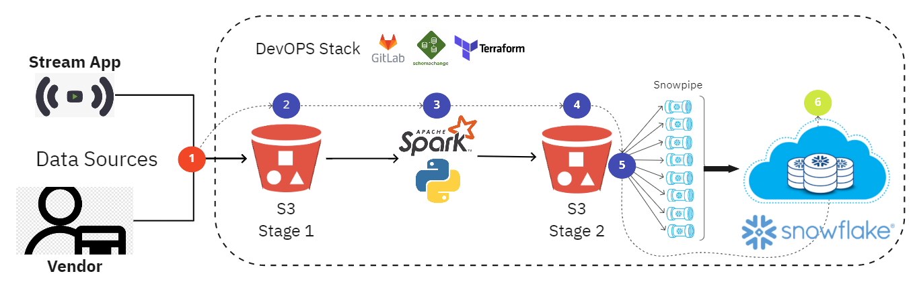

# EDA and Data Pipeline for a Video Streaming Company

## Goals

- Use of Docker Container to unlock fast jupyter notebook lab already containing necessary data for EDA.
- Use of PySpark to perform EDA and ETL.
- Design a comprehensive Data Pipeline capable of handling Streaming App data.

## Install

In order to run the pyspark notebook in your local, you can run a container using the provided docker file.

**1) Create sta-data-egineer image**
```shell
docker build . -t sta-data-egineer
```

**2) Run a container**
```shell
docker run -p 8888:8888 sta-data-egineer
```


**3) Access the following URL**
http://localhost:8888/


## **Phase 1**
---
   Spark engine in local mode has been adopted to accomplish ETL tasks, unlocking business questions in a fast manner.

   Views have been created and queried using Spark SQL.
   
   For a real production environment the spark transformations and operations would be practically the same, however the infrasctructure  
   
   
   and architecture of the pipeline would become more complex, requiring a robust stack of technologies which will be mentioned in phase 3.

## **Phase 2**
---

You can check the code for the Q/A in EDA.ipynb.


- What percentage of the streamed movies are based on books?

    93.40%
- How many users were watching "Unforgiven" on Christmas morning (between 7 am and 12 noon on December 25)?

    1

- How many movies based on books written by Singaporeans authors were streamed that month?

    3

- What's the average streaming duration?

    12.04 hours

- What's the **median** streaming size in gigabytes?

    935.439

- How many users watched at least 50% of any movie in the last week of the month (7 days)?

    65

## **Phase 3**
---
The choosen architecture adopts ELT, allowing transformations to occur when really needed.

It starts with AWS S3 to create a highly available, consistent and durable Data Lake. 

2 buckets would work in serial. The first bucket (stage 1) receives data from the streaming app and vendor.

**Streaming App Workflow**

Everytime a new file reaches Stage 1, S3 Event Notification is triggered and activates a pyspark microservice responsible to split the file in smaller ones and stage them in stage 2 bucket.

Those smaller files are then ingested into Snowflake DW tables by snowpipes (Snowflake Serverless Service) which are triggered by the same pyspark microservice through REST API.

**Vendor Data Workflow**

Considering it batch nature, the vendor data should be treated a little bit differently. 
Instead of using Snowpipes, Snowflake Python Connector would definetly offer a better performance with less latency and higher I/O.
The table inside Snowflake would be replaced by a new one that is going to receive the bulk data load.


**DevOps Stack**

Gitlab CI/CD, Terraform, and Schemachange python framework technologies have been selected to provide modualrity, extensibility, realiability, velocity and consistency for the Development Operations.





**References**


https://programmaticponderings.com/2019/12/06/getting-started-with-data-analytics-using-jupyter-notebooks-pyspark-and-docker/


https://docs.aws.amazon.com/AmazonS3/latest/userguide/NotificationHowTo.html


https://github.com/Snowflake-Labs/schemachange


https://hub.docker.com/r/jupyter/all-spark-notebook/


https://docs.gitlab.com/ee/ci/


https://registry.terraform.io/providers/chanzuckerberg/snowflake/latest/docs


https://registry.terraform.io/providers/hashicorp/aws/latest


https://spark.apache.org/sql/


https://globant.udemy.com/course/learn-docker


https://medium.com/@suci/running-pyspark-on-jupyter-notebook-with-docker-602b18ac4494


https://analyticsindiamag.com/top-7-free-resources-to-learn-snowflake/

